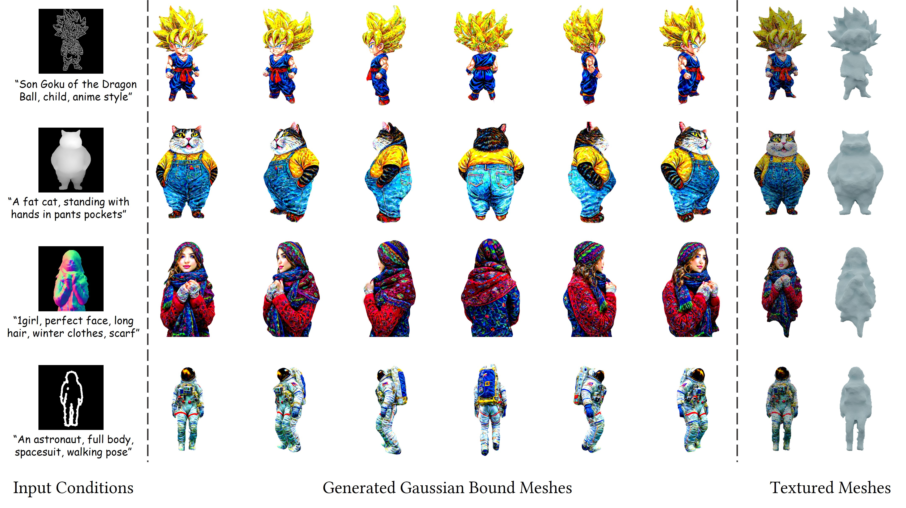
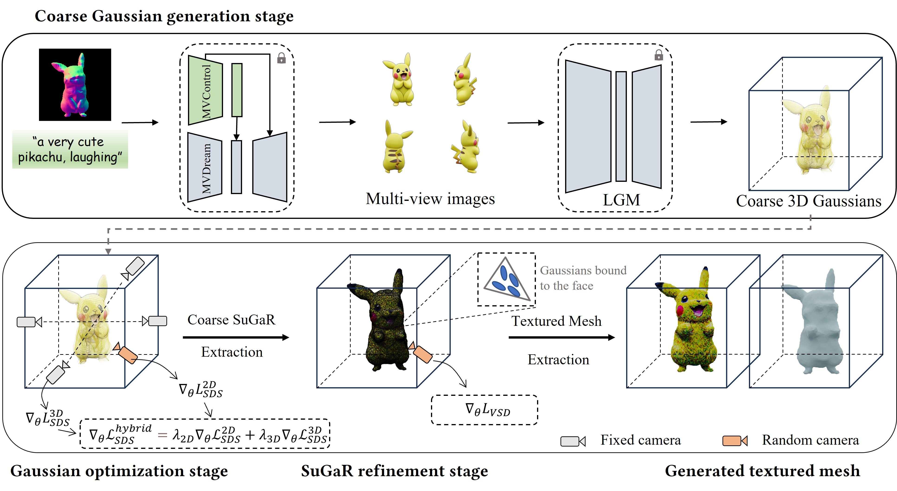

# MVControl-threestudio

[**ArXiv**](https://arxiv.org/abs/2403.09981) | [**Paper**](./assets/paper.pdf) | [**Project Page**](https://lizhiqi49.github.io/MVControl/)

Official implementation of *Controllable Text-to-3D Generation via Surface-Aligned Gaussian Splatting*

[Zhiqi Li](https://github.com/lizhiqi49), [Yiming Chen](https://github.com/codejoker-c), [Lingzhe Zhao](https://github.com/LingzheZhao), [Peidong Liu](https://ethliup.github.io/)

**Abstract**: *While text-to-3D and image-to-3D generation tasks have received considerable attention, one important but under-explored field between them is controllable text-to-3D generation, which we mainly focus on in this work. To address this task, 1) we introduce Multi-view ControlNet (MVControl), a novel neural network architecture designed to enhance existing pre-trained multi-view diffusion models by integrating additional input conditions, such as edge, depth, normal, and scribble maps. Our innovation lies in the introduction of a conditioning module that controls the base diffusion model using both local and global embeddings, which are computed from the input condition images and camera poses. Once trained, MVControl is able to offer 3D diffusion guidance for optimization-based 3D generation. And, 2) we propose an efficient multi-stage 3D generation pipeline that leverages the benefits of recent large reconstruction models and score distillation algorithm. Building upon our MVControl architecture, we employ a unique hybrid diffusion guidance method to direct the optimization process. In pursuit of efficiency, we adopt 3D Gaussians as our representation instead of the commonly used implicit representations. We also pioneer the use of SuGaR, a hybrid representation that binds Gaussians to mesh triangle faces. This approach alleviates the issue of poor geometry in 3D Gaussians and enables the direct sculpting of fine-grained geometry on the mesh. Extensive experiments demonstrate that our method achieves robust generalization and enables the controllable generation of high-quality 3D content.*

<p align="center">
    
</p>


## Method Overview
<p align="center">
    
</p>


## News

- **[2024-05-30]** We have fixed the previous **noisy color issue** of refined SuGaR and textured mesh by using a smaller learning rate for Gaussians' color, the new demo results have been updated in our [**Project Page**](https://lizhiqi49.github.io/MVControl/)!


## Installation

### Install threestudio

<del>**This part is the same as original threestudio repository, skip it if you have already installed the environment.**</del>

**!!! The `requirement.txt` we use is slightly different from the original threestudio repository (the version of diffusers and gradio). If error occurs with the original threestudio env, please use our configuration file.**

See [installation.md](docs/installation.md) for additional information, including installation via Docker.

The following steps have been tested on Ubuntu20.04.

- You must have an NVIDIA graphics card with at least 6GB VRAM and have [CUDA](https://developer.nvidia.com/cuda-downloads) installed.
- Install `Python >= 3.8`.
- (Optional, Recommended) Create a virtual environment:

```sh
python3 -m virtualenv venv
. venv/bin/activate

# Newer pip versions, e.g. pip-23.x, can be much faster than old versions, e.g. pip-20.x.
# For instance, it caches the wheels of git packages to avoid unnecessarily rebuilding them later.
python3 -m pip install --upgrade pip
```

<del>- Install `PyTorch >= 1.12`. We have tested on `torch1.12.1+cu113` and `torch2.0.0+cu118`, but other versions should also work fine.</del>
- Install `PyTorch == 2.2.1` since `xformers` requires newest torch version.

```sh
# newest torch version under cuda11.8
pip install torch torchvision --index-url https://download.pytorch.org/whl/cu118
```

- (Optional, Recommended) Install ninja to speed up the compilation of CUDA extensions:

```sh
pip install ninja
```

- Install dependencies:

```sh
pip install -r requirements.txt
```

- (Optional) `tiny-cuda-nn` installation might require downgrading pip to 23.0.1

- (Optional, Recommended) The best-performing models in threestudio use the newly-released T2I model [DeepFloyd IF](https://github.com/deep-floyd/IF), which currently requires signing a license agreement. If you would like to use these models, you need to [accept the license on the model card of DeepFloyd IF](https://huggingface.co/DeepFloyd/IF-I-XL-v1.0), and login into the Hugging Face hub in the terminal by `huggingface-cli login`.

- For contributors, see [here](https://github.com/threestudio-project/threestudio#contributing-to-threestudio).

### Install 3D Gaussian dependencies

```sh
git clone --recursive https://github.com/ashawkey/diff-gaussian-rasterization
git clone https://github.com/DSaurus/simple-knn.git
pip install ./diff-gaussian-rasterization
pip install ./simple-knn
```

### Install SuGaR dependencies

```sh
pip install open3d
# Install pytorch3d
pip install "git+https://github.com/facebookresearch/pytorch3d.git@stable"
```

### Install LGM dependencies
```sh
pip install -r requirements-lgm.txt
```

## Download pre-trained models

- For [LGM](https://github.com/3DTopia/LGM), following the instructions in their official repository.
```sh
mkdir pretrained && cd pretrained
wget https://huggingface.co/ashawkey/LGM/resolve/main/model_fp16.safetensors
cd ..
```

- For [MVDream](https://github.com/bytedance/MVDream), we use our [diffusers implementation](https://github.com/lizhiqi49/mvdream-diffusers). The weights will be downloaded automatically via huggingface hub.

- Our pre-trained multi-view ControlNets have been uploaded to huggingface hub, and they will also be automatically downloaded. 

- Or you can also manually download the MVDream and MVControls' checkpoints from [here](https://huggingface.co/lzq49).

## Quickstart

### Stage 1. Generate coarse 3D Gaussians via MVControl + LGM
The following command will launch a GUI powered by gradio. 
You should fill in `asset_name` box with the name of current experiment, and the results will be saved in directory `workspace/mvcontrol_[condition_type]/[asset_name]`. The input image can be both condition image or a RGB image. When RGB image is input, the option `image need preprocess` on top left of the UI should be tagged, so that condition image, mask, and RGBA images will be saved in the output directory.
```sh
condition_type=depth  # canny/depth/normal/scribble
python app_stage1.py big --resume path/to/LGM/model_fp16.safetensors --condition_type $condition_type
# The generated coarse Gaussians will be saved to workspace/mvcontrol_{condition_type}/{asset_name}/coarse_gs.ply
```

### Stage 2. Gaussian Optimizaiton
```sh
### Taking 'fatcat' as example
asset_name=fatcat
exp_root_dir=workspace/mvcontrol_$condition_type/$asset_name
hint_path=load/conditions/fatcat_depth.png  # path/to/condition.png
mask_path=load/conditions/fatcat_mask.png   # path/to/mask.png
prompt="A fat cat, standing with hands in ponts pockets"  # prompt
coarse_gs_path=$exp_root_dir/coarse_gs.ply # path/to/saved/coarse_gs.ply

python launch.py --config custom/threestudio-3dgs/configs/mvcontrol-gaussian.yaml --train --gpu 0 \
system.stage=gaussian \
system.hint_image_path=$hint_path \
system.hint_mask_path=$mask_path \
system.control_condition_type=$condition_type \
system.geometry.geometry_convert_from=$coarse_gs_path \
system.prompt_processor.prompt='$prompt' \
system.guidance_control.pretrained_controlnet_name_or_path='lzq49/mvcontrol-4v-${condition_type}' \
name=$asset_name \
tag=gaussian_refine

# # If use only coarse Gaussians' positions for initialization
# # Add the following two options in the command 
# system.geometry.load_ply_only_vertex=ture \
# system.geometry.load_vertex_only_position=true


### Extract coarse SuGaR from refined Gaussians
refined_gs_path=$exp_root_dir/gaussian_refine@LAST/save/exported_gs_step3000.ply
coarse_sugar_output_dir=$exp_root_dir/coarse_sugar

python extern/sugar/extract_mesh.py -s extern/sugar/load/scene \
-c $refined_gs_path -o $coarse_sugar_output_dir --use_vanilla_3dgs
```

### Stage 3. SuGaR refinement
```sh
sugar_mesh_path=$coarse_sugar_output_dir/sugarmesh_vanilla3dgs_level0.3_decim200000_pd6.ply

python launch.py --config custom/threestudio-3dgs/configs/mvcontrol-sugar-vsd.yaml --train --gpu 0 \
system.stage=sugar \
system.hint_image_path=$hint_path \
system.hint_mask_path=$mask_path \
system.control_condition_type=$condition_type \
system.geometry.surface_mesh_to_bind_path=$sugar_mesh_path \
system.prompt_processor.prompt='$prompt' \
system.guidance_control.pretrained_controlnet_name_or_path='lzq49/mvcontrol-4v-${condition_type}' \
name=$asset_name \
tag=sugar_refine

### Textured mesh extraction
sugar_out_dir=$exp_root_dir/sugar_refine@LAST
python launch.py --config $sugar_out_dir/configs/parsed.yaml --export --gpu 0 resume=$sugar_out_dir/ckpts/last.ckpt
```

### Easy way
We also provide a script running stage2 and stage3 from generated coarse Gaussians automatically:
```sh
python run_from_coarse_gs.py -n $asset_name -c $condition_type -p '$prompt' -cp $hint_path -mp $mask_path
```

## Tips
- Our method relies on coarse Gaussian initialization. So in the first stage, it's OK to try different random seeds to get a good LGM output, since the coarse Gaussian generation procedure is very fast (several seconds).
- For better Gaussian optimization in stage 2, longer optimization steps can be used. We use 3000 steps in our paper for efficiency.


## Todo

- [x] Release the inference code.
- [ ] Reorgenize the code.
- [ ] Improve the quality (texture & surface) of SuGaR refinement stage.
- [ ] Provide more examples for test.

## Credits
This project is built upon the awesome project [threestudio](https://github.com/threestudio-project) and thanks to the open-source of these works: [LGM](https://github.com/3DTopia/LGM), [MVDream](https://github.com/bytedance/MVDream), [ControlNet](https://github.com/lllyasviel/ControlNet) and [SuGaR](https://github.com/Anttwo/SuGaR).


## BibTeX

```bibtex
@misc{li2024controllable,
      title={Controllable Text-to-3D Generation via Surface-Aligned Gaussian Splatting}, 
      author={Zhiqi Li and Yiming Chen and Lingzhe Zhao and Peidong Liu},
      year={2024},
      eprint={2403.09981},
      archivePrefix={arXiv},
      primaryClass={cs.CV}
}
```

